# UX-UI Baseline: S0-01 „Baseline-Flows dokumentieren“

## Scope und Methode
- Bearbeitet wurde ausschließlich Aufgabe **S0-01** aus `UX_UI_REVIEW_SPRINT_PLAN.md`.
- Prüfungen erfolgten über Browser-basierte Verifikation (Desktop + Mobile Viewports).
- Erfassung der geforderten Flows inkl.:
  - Ausgangszustand
  - Aktionen
  - erwartetes Ergebnis
  - tatsächliches Ergebnis
  - Screenshot

## Baseline-Ausgangszustände

### Startansicht (ohne geöffnetes Personen-Sheet)
- 390×844  
  
- 768×1024  
  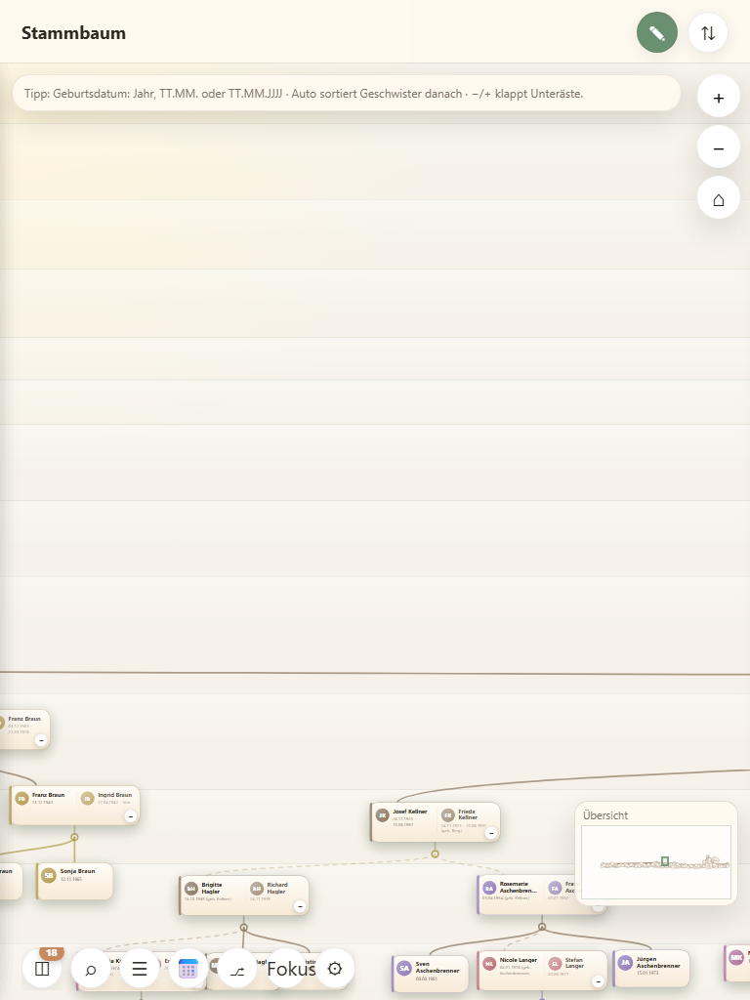
- 1440×900  
  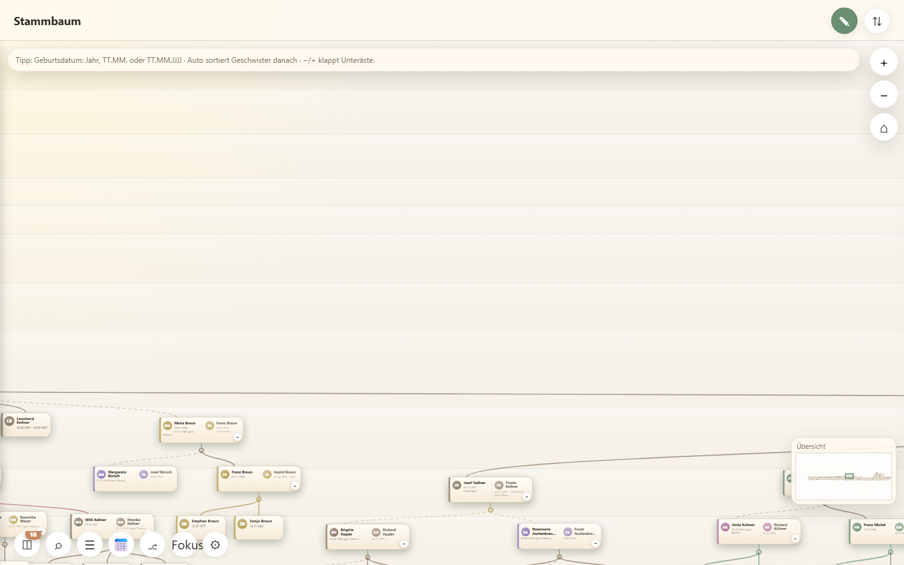

### Personen-Sheet nach Suchauswahl (Person-Detail-Sheet offen, Titel „Person“)
- 390×844  
  
- 768×1024  
  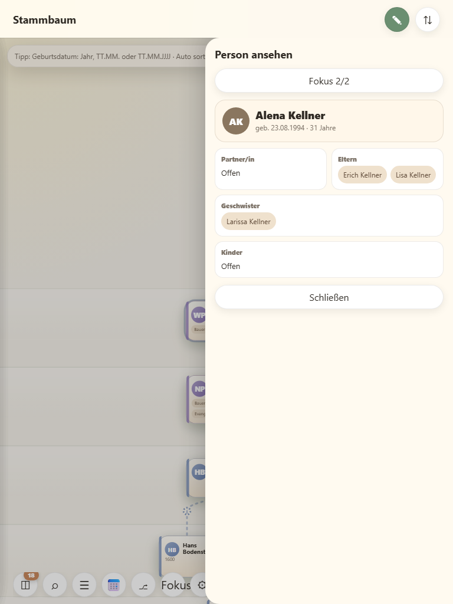
- 1440×900  
  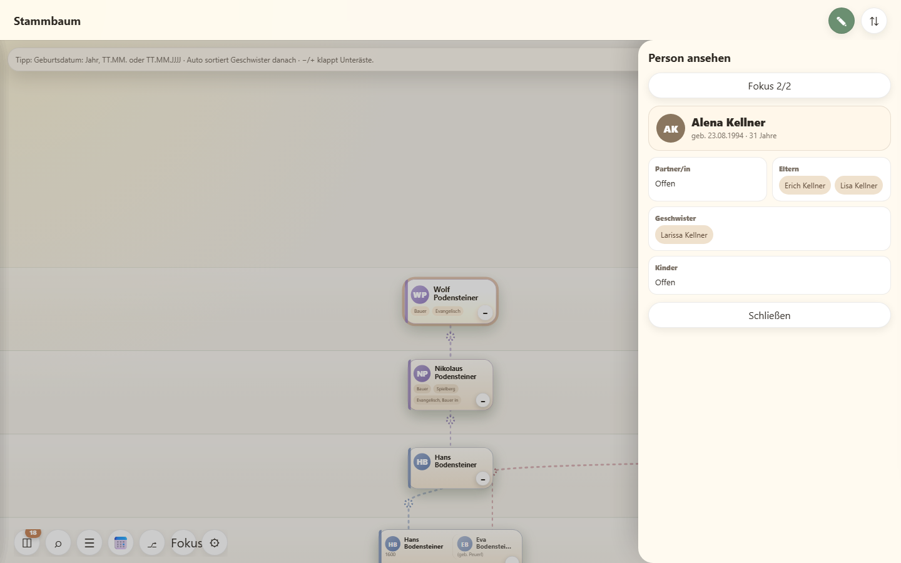

## Dokumentation der Flows

### 1) App öffnen
- **Ausgangszustand:** App lädt mit Fokus auf `BODY`.
- **Aktionen:** App gestartet.
- **Erwartetes Ergebnis:** Startansicht ohne geöffnetes Personen-Sheet.
- **Tatsächliches Ergebnis:** Startansicht ohne Personen-Sheet sichtbar.
- **Screenshot:**  
  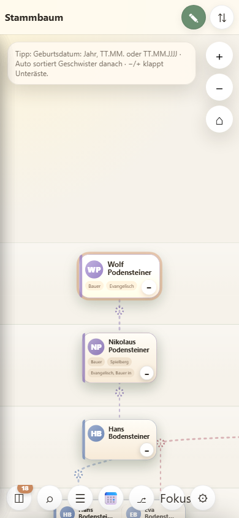
- **Fokus:** `BODY`
- **Bemerkung:** Keine sichtbaren Dialoge.

### 2) Person suchen
- **Ausgangszustand:** Detail-Sheet ist geschlossen.
- **Aktionen:** Suche öffnen → Suchbegriff `a` eingeben.
- **Erwartetes Ergebnis:** Suchoberfläche mit Trefferliste wird angezeigt.
- **Tatsächliches Ergebnis:** Suchoberfläche mit Trefferliste und sichtbaren Ergebnissen.
- **Screenshot:**  
  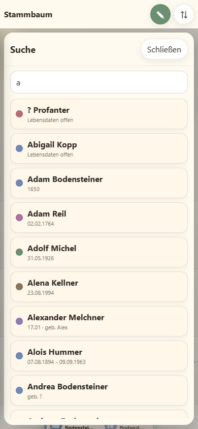
- **Fokus:** `#personSearch`

### 3) Person ansehen
- **Ausgangszustand:** Suche war offen bzw. nicht aktiviert.
- **Aktionen:** Suchansicht schließen → gerenderten Personen-Knoten öffnen.
- **Erwartetes Ergebnis:** Personensheet im Ansichtsmodus ist sichtbar.
- **Tatsächliches Ergebnis:** Personen-Sheet ist sichtbar.
- **Screenshot:**  
  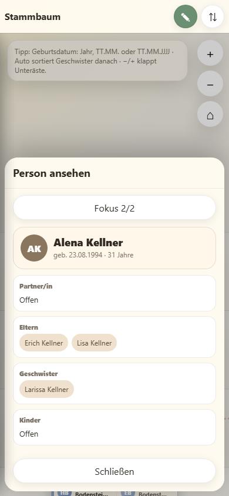
- **Fokus:** `#personSearch`

### 4) Bearbeiten aktivieren
- **Ausgangszustand:** Personensheet im Ansichtsmodus.
- **Aktionen:** Bearbeitungsmodus über Modus-Button aktiviert.
- **Erwartetes Ergebnis:** Titel und Felder werden editierbar.
- **Tatsächliches Ergebnis:** Editiermodus aktiv, Felder editierbar.
- **Screenshot:**  
  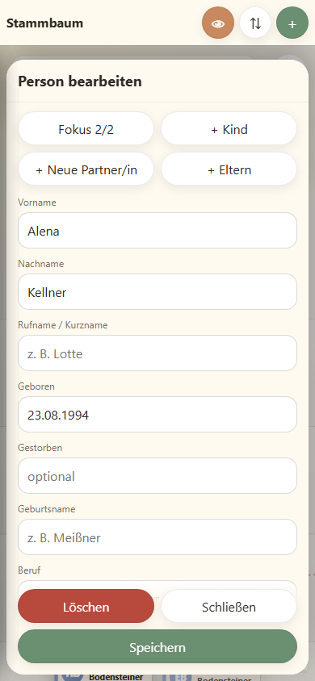
- **Fokus:** `#personSearch`

### 5) Person speichern
- **Ausgangszustand:** Bearbeitungsmodus aktiv, Personensheet geöffnet.
- **Aktionen:** 
  - a) **Aktion „Speichern“:** Im geöffneten Bearbeitungs-Sheet wurde der Nachname auf `Baselinecheck` gesetzt und der Button **Speichern** angeklickt.
  - b) **Beobachtete Sheet-Schließung:** Direkt nach dem Klick wurde geprüft, dass der Sheet-Container nicht mehr geöffnet ist (`sheet.open == false`).
  - c) **Zusätzliche Verifikation durch erneutes Öffnen:** Anschließend wurde die gleiche Person erneut im Ansichtsmodus geöffnet.
- **Erwartetes Ergebnis:** Personensheet wird gespeichert und erneut lesbar geöffnet.
- **Tatsächliches Ergebnis:** Speichervorgang durchgeführt, Sheet wurde tatsächlich geschlossen. Nach erneutem Öffnen im Ansichtsmodus ist die Person lesbar angezeigt; „Baselinecheck“ ist im Detail sichtbar und der Speichern-Button ist nicht mehr sichtbar.
- **Screenshot:**  
  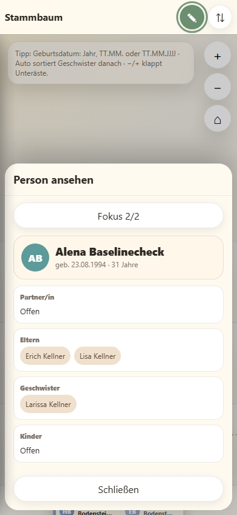
- **Fokus nach Speichern:** `#saveBtn`
- **Fokus nach erneutem Öffnen im Ansichtsmodus:** `#modeBtn`

### 6) JSON importieren
- **Ausgangszustand:** App mit Standard-Datensatz.
- **Aktionen:** Standard-Datensatz wurde über den Datei-Input durch einen isolierten Testdatensatz ersetzt:  
  `Vorname: Import`, `Nachname: Muster`, `geboren: 1972`.
- **Erwartetes Ergebnis:** Import-Datensatz wird geladen und sichtbar.
- **Tatsächliches Ergebnis:** Import-Datensatz wurde geladen; die Personen-Darstellung enthält **„Import Muster“**. Ein Personen-Sheet wurde dabei nicht geöffnet.
- **Screenshot:**  
  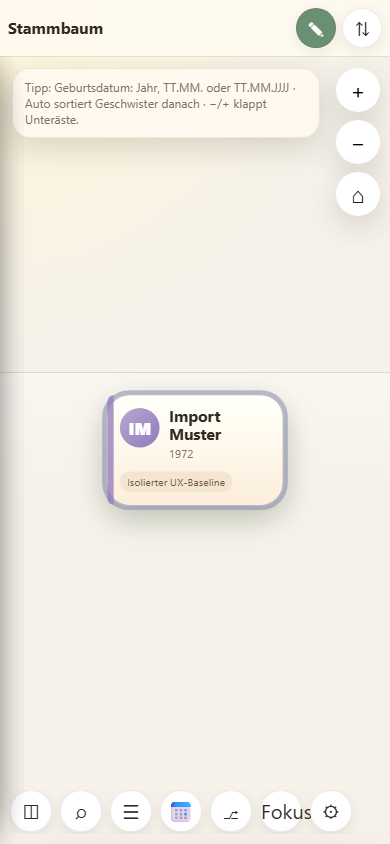
- **Fokus nach Import:** `#closeBtn`

### 7) JSON exportieren
- **Ausgangszustand:** Datensatz importiert bzw. geladen.
- **Aktionen:** Export-Button ausgelöst.
- **Erwartetes Ergebnis:** Export startet; ggf. Download-Fallback wird angezeigt, wenn kein Ziel-Dialog aufnehmbar ist.
- **Tatsächliches Ergebnis:** Export wurde angestoßen; nachfolgender Download-Dialogtext beobachtet.
- **Screenshots:**  
    
  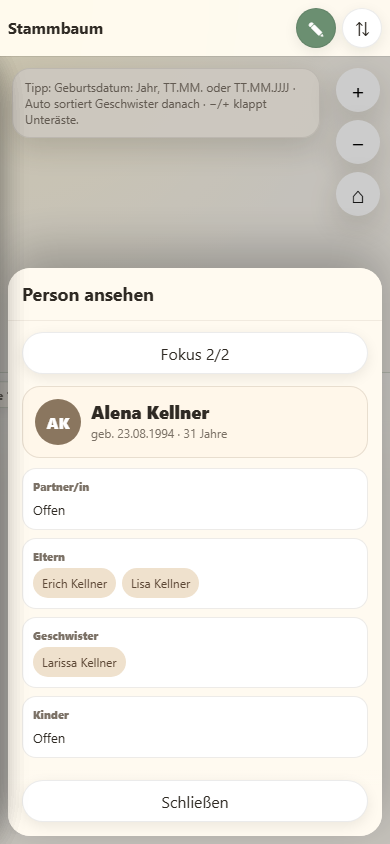
- **Fokus vor/nach Export:** `BODY`
- **Dialogbeobachtung (Automationsprotokoll):**  
  „Speichern am gewählten Zielort ist fehlgeschlagen. Es wird ein Download gestartet.“  
  In der automatisierten Testumgebung beobachtet; manuelle Reproduktion noch offen.

## Nachweis der Bild-Referenzen

Alle folgenden Links wurden geprüft und die Bilder erfolgreich geöffnet.  
Die nachfolgenden Größen wurden validiert:

- `ux-baseline-screenshots/start-390x844.png` → 390×844
- `ux-baseline-screenshots/start-768x1024.png` → 768×1024
- `ux-baseline-screenshots/start-1440x900.png` → 1440×900
- `ux-baseline-screenshots/person-sheet-390x844.png` → 390×844
- `ux-baseline-screenshots/person-sheet-768x1024.png` → 768×1024
- `ux-baseline-screenshots/person-sheet-1440x900.png` → 1440×900
- `ux-baseline-screenshots/flow-app-open-390x844.png` → 390×844
- `ux-baseline-screenshots/flow-person-search-390x844.png` → 390×844
- `ux-baseline-screenshots/flow-person-ansehen-390x844.png` → 390×844
- `ux-baseline-screenshots/flow-bearbeiten-aktivieren-390x844.png` → 390×844
- `ux-baseline-screenshots/flow-person-speichern-390x844.png` → 390×844
- `ux-baseline-screenshots/flow-json-import-390x844.png` → 390×844
- `ux-baseline-screenshots/flow-json-export-390x844-before.png` → 390×844
- `ux-baseline-screenshots/flow-json-export-390x844-after.png` → 390×844

Identische Darstellung mit Begründung:

- `flow-person-ansehen` nutzt denselben visuellen Zustand wie `person-sheet-390x844`, da der geforderte Zustand hier als direkt identisches Personen-Sheet repräsentiert.
- `flow-json-export-before` und `flow-json-export-after` sind visuell gleich, da kein zusätzlicher sichtbarer UI-Zustandswechsel zwischen Ausführung und Rückkehr in den selben Zustand stattgefunden hat; der Export-Dialog war nur als beobachteter Systemdialogtext verfügbar.

## Akzeptanzkriterienprüfung S0-01 (Einzeln)
- **AC 1 (Dokumentation je Flow mit allen Pflichtfeldern):** Erfüllt für alle 7 Flows.
- **AC 2 (Screenshot pro Flow):** Erfüllt; bei „JSON exportieren“ wurde der Zustand vor und nach dem Export dokumentiert.
- **AC 3 (Baseline bei geforderten Viewports):** Erfüllt für 390×844, 768×1024 und 1440×900 in Start- und Personen-Sheet-Zustand.
- **AC 4 (Nur S0-01 bearbeitet):** Erfüllt; keine weitere Aufgabe bearbeitet.
- **AC 5 (Keine Produktdateien verändert):** Erfüllt; in diesem Artefakt wurden `app.js`, `index.html` und `style.css` nicht verändert.
